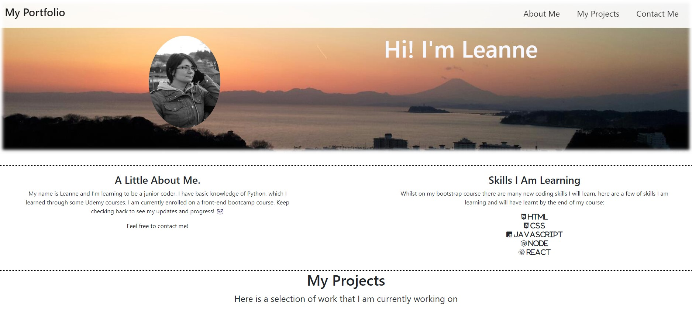
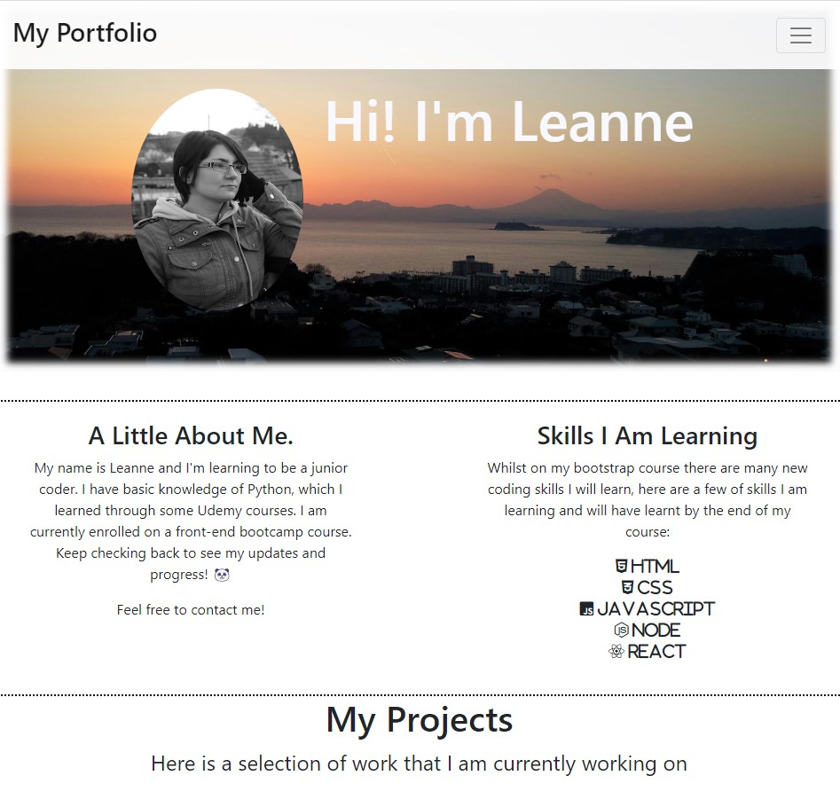
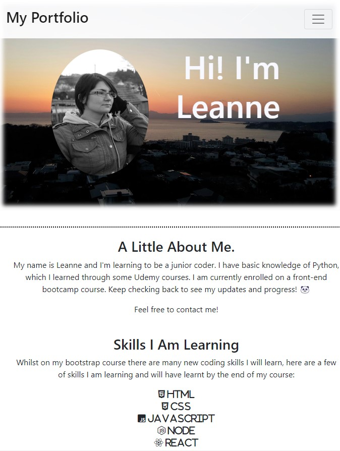

# Bootstrap Portfolio

## Description 

This website is my first attempt at a bootstrap Portfolio. It will be added to over time as i create more projects or webpages that I can link to this page.. 

I have an active navbar at the top which links you to my three sections, about me, my work projects (currently placeholders to a coming soon website) and a contact me section with working links to my various media platforms.

It is currently a simple layout with my own photos as background and placeholder images I tried to keep a colour scheme which linked to the background Image, I will most likely change this over time.

## Usage 

The portfolio page currently has three links at the top taking you to different areas of the page. It also has links in the contact me section which allow users to contact me in various ways.

Here is a screen shot of my webpage in all three media sizes.

Link to active website: https://Leanne-Annable.github.io/Bootstrap-Portfolio/

## Credits

I used Font Awesome for the icons on my webpage. I used w3schools and stackoverflow for the main sources of information when i encountered issues with my webpage. I was also offered positioning tips by some classmates in the slack channel.

## License

This webpage is licenced under the MIT Licence

© 2022 edX Boot Camps LLC. Confidential and Proprietary. All Rights Reserved.